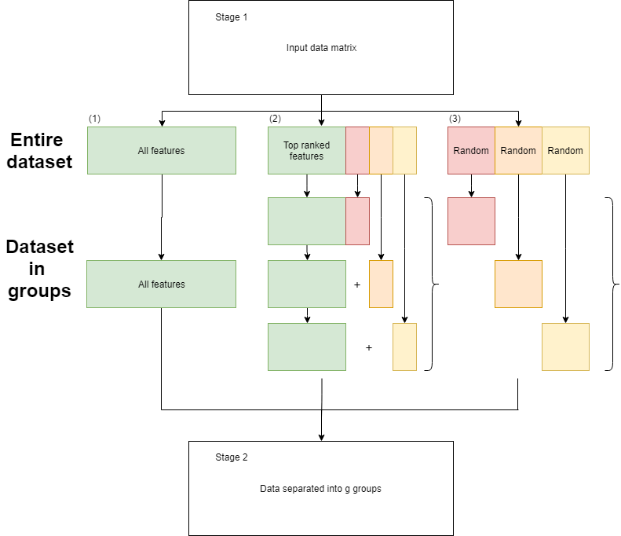

<!-- README.md is generated from README.Rmd. Please edit that file -->

# VIVID: Visualisation of Variable Importance Differences

**Author**: Connor Smith, Samuel Mueller & Boris Guennewig

The **VIVID** (Variability of Variable Importance Differences) package
implements both a feature selection method and visualization for complex
data. Similar to filter methods, we utilize feature rankings but then
proceed to make decisions on how these ranks change over resamples. This
information is then visualized through a heat map style plot which
highlights groups of features with lower variability in there rankings.
When using this package, you are able to identify features which are
shown to be important when modeling a response feature such as treatment
and control groups of a disease. You are also then able to use
visualization to see how this group of features compares with other
suitable candidate groups of a similar nature.

## Goals

Within VIVID we aim to achieve a variety of goals which include:

1.  Remove the arbitrary cut-off employed when selecting the top \(k\)
    features through a filtering style method.
2.  VIVID uses more re-sampling information before aggregating the data
    down to single values.
3.  Considers pairwise comparisons of importance metrics over B
    re-samples.
4.  Provides a visualization method, through which key features can be
    identified.

# Methodology

When a regression model is fit to data, the size of corresponding
coefficients, relative to other features, highlights how important a
given feature is. We use the feature rankings of these measures to then
observe how pairs of features change relative to other features around
them. Groups of features with smaller variability are then identified
and considered a candidate group. Given a dataset where only a few
features are important (sparse), the majority will have true
coefficients equal to 0 creating a large group of features whose ranks
vary significantly. These candidate models are then compared and the
most optimal solution picked. A detailed version of the method is
outlined below.

## Installation

``` r
library(devtools)
devtools::install_github("binfnstats/VividR")
install.packages('ropls')
install.packages('furrr')
```

## A quick example

``` r
library('VIVID')
library('ropls')

data("sacurine") #Load sacurine dataset from the 'ropls' package

dat <- sacurine$dataMatrix
outcomes <- sacurine$sampleMetadata$gender

vivid.sacurine <- vivid(x = dat,
                        y = outcomes,
                        bootstraps = 50,
                        cores = parallel::detectCores() - 1,
                        seed = 1234567,
                        lambda = 'lambda.1se',
                        compareMethod = 'BIC')
```

From the feature selection algorithm using the BIC we have selected:

``` r
vivid.sacurine$optFeatures
#> [1] "X.gamma.Glu.Leu.Ile"          "Glu.Val"                     
#> [3] "Gluconic.acid.and.or.isomers" "Malic.acid"                  
#> [5] "N2.Acetylaminoadipic.acid"    "Oxoglutaric.acid"            
#> [7] "p.Hydroxyhippuric.acid"       "Pantothenic.acid"            
#> [9] "Testosterone.glucuronide"
```

And produces the following MVP plot for the entire 109 features on a log
scale:

``` r
vivid_plot(vivid.sacurine, log = TRUE, topN = 0)
```

<!-- -->

From this we are able to see that most of the features can be ignored so
we produce a new MVP plot with the top 25 features:

``` r
vivid_plot(vivid.sacurine, log = FALSE, topN = 25)
```

<!-- -->

From the above plots we are able to confirm the slections by the
automated feature selection algorithm part of VIVID.

# More Details

## VIVID Method

1.  Obtain a dataset containing a design matrix \(X\) with \(p\)
    features and \(n\) observations and a response vector \(y\) of
    corresponding length with two classes.
2.  Fit regression models to resampled data:
      - Bootstrapping is performed by generating new observation weights
        from the data. These weights are generated from an \(exp(1)\)
        distribution and sum to \(n\).
      - A logistic regression is then fit to each re sample using Ridge
        estimates.
3.  Calculate measures of feature importance \(s_i\) by taking the
    absolute value of the regression coefficients,
    \(s_i = |\hat{\beta}_i|\).
4.  Calculate the variance of each pairwise comparison of ranks between
    two features, \(h_{ij} = var(r_i - r_j)\).
5.  The features are then clustered using the corresponding rows in the
    \(p\) by \(p\) matrix \(H\) constructed in step (4).
6.  The algorithm then searches through the dendogram to find the groups
    of features with the lowest pairwise variance.
7.  Once the groups of features have been identified, the Extended
    Bayesian Information Criterion (EBIC) is then used to identify the
    best group of features.

Due to the construction of a \(p\) by \(p\) matrix, if \(p\) is two
large a divide and conquer method is implemented, as seen in Figure 1.


## *VIVID* feature selection

The first step is to identify all the features to be included in the
comparison. Since no pre-filtering step is being implemented we will use
all features.

``` r
p <- NCOL(dat) # p = 109
p
#> [1] 109
```

The remaining parameters which can be set adjusted:

  - **bootstraps**: number of resamples to be completed (should change
    depending on data size)
  - **cores**: how many cores to use for the parallel implementation of
    model fitting.
  - **seed**: seven digits to allow to for reproducible results.
  - **lambda**: the values of lambda used to select the optimal
    regression fit; see **glmnet** for explanation.
  - **compare\_method**: method of comparison between models. EBIC is
    chosen as the default method.
  - **gamma**: If **compare\_method** = “EBIC” then this feature is
    used.
  - **min\_size**: When identifying important sets of features when
    searching through the dendogram,

If no input is given, then each feature will resort to their default
values:

  - bootstrap = 100
  - cores = 1
  - seed = 1234567
  - lambda = lambda.1se
  - compare\_method = BIC
  - gamma = 1
  - min\_size = 2

The function returns the following outputs:

  - **coefficients**: a matrix containing all regression estimates from
    the resamples. This is a \(p\) by \(B\) matrix.
  - **var\_mat**: a matrix containing the variance of the resampled
    difference in feature ranks. This is a \(p\) by \(p\) matrix.
  - **var\_clust**: a hierarchical cluster analysis performed on the
    above variance matrix. This is a hclust object returned from the
    function **hclust**.
  - **selection**: a binary matrix which contains the features selected
    at each stage VIVID method. A FALSE indicates the feature is not
    included and a TRUE indicates the variable is included. This is a
    \(p\) by \(k\) matrix, where \(k\) is the number of distinct groups
    of features identified.
  - **sizes**: a vector containing the sizes of all distinct groups of
    features identified.
  - **compare\_method**: used to identify what function was supplied as
    an input.
  - **compare\_values**: the values produced from the comparison method
    for the groups of features identified.
  - **opt\_model**: a binary vector of length \(p\) identifying the
    group of features which best optimize the comparison method,
    features are identified/ignored with the value of TRUE/FALSE
    respectively.
  - **opt\_features**: a vector containing the names of the features in
    the optimal group of features.

## Selection of Different outputs

### Clustering

``` r
vivid.sacurine$varClust
#> 
#> Call:
#> stats::hclust(d = varDist)
#> 
#> Cluster method   : complete 
#> Distance         : euclidean 
#> Number of objects: 109
```

### Feature group sizes

``` r
vivid.sacurine$sizes
#>  [1] 104  60  39  19  15  13  11   9   8   6   3   2
```

### Best feature group (Names)

``` r
vivid.sacurine$optFeatures
#> [1] "X.gamma.Glu.Leu.Ile"          "Glu.Val"                     
#> [3] "Gluconic.acid.and.or.isomers" "Malic.acid"                  
#> [5] "N2.Acetylaminoadipic.acid"    "Oxoglutaric.acid"            
#> [7] "p.Hydroxyhippuric.acid"       "Pantothenic.acid"            
#> [9] "Testosterone.glucuronide"
```

## Number of features returned

If the number of features returned is to small, there are several
options on how to deal with this situation.

1.  Using the function vivid\_adj() you can define the minimum number of
    features you require and this will select the candidate group with
    size larger than this group.

<!-- end list -->

``` r
# Minimum number of final features set to 10
vivid_adj(vivid.sacurine, 
          minFinalFeatures = 10)
#> $optFeatures
#>  [1] "X.gamma.Glu.Leu.Ile"                "X4.Acetamidobutanoic.acid.isomer.3"
#>  [3] "Glu.Val"                            "Gluconic.acid.and.or.isomers"      
#>  [5] "Glyceric.acid"                      "Malic.acid"                        
#>  [7] "N.Acetyl.aspartic.acid"             "N2.Acetylaminoadipic.acid"         
#>  [9] "Oxoglutaric.acid"                   "p.Anisic.acid"                     
#> [11] "p.Hydroxyhippuric.acid"             "p.Hydroxymandelic.acid"            
#> [13] "Pantothenic.acid"                   "Testosterone.glucuronide"          
#> [15] "Xanthosine"                        
#> 
#> $n
#> [1] 15
```

2.  Instead of running the VIVID function all over again, there is
    simple code to change the objective function used. To complete this
    use the following function:

<!-- end list -->

``` r
# Change from BIC to AIC
vivid.saccurinenew <- vivid_crit(vivid.sacurine,
                                 x = dat,
                                 y = outcomes,
                                 metric = "AIC")
```

## Large number of features

If the dataset has a large number of features then the variance matrix
will be large. Since this matrix is of the order \(p^2\), we have
implemented a divide and conquer approach. Figure 1 describes the VIVID
method when we use this approach.

The way this functions is by dividing the data into \(g\) different
groups and then applying VIVID to each group and identifying the best
features. We then combine those set of features and run VIVID again to
select the final features. There are multiple ways to split the data,
however in this package we have decided to implement only two. This is
done by either using disjoint groups or overlapping groups as seen in
Figure 2.



To run this version of the code, the following function is used.

``` r
groups = 5
vivid.sacurine_split <- vivid_split(x = dat,
                        y = outcomes,
                        bootstraps = 75,
                        cores = parallel::detectCores() - 1,
                        seed = 1234567,
                        lambda = 'lambda.min',
                        compareMethod = 'BIC',
                        groups = groups,
                        disjoint = TRUE)
```

And having split the data into 5 disjoint groups, the following features
are selected.

``` r
vivid.sacurine_split[[groups+1]]$optFeatures
#>  [1] "X4.Acetamidobutanoic.acid.isomer.3" "Glu.Val"                           
#>  [3] "Malic.acid"                         "N2.Acetylaminoadipic.acid"         
#>  [5] "Oxoglutaric.acid"                   "p.Hydroxyhippuric.acid"            
#>  [7] "p.Hydroxymandelic.acid"             "Pantothenic.acid"                  
#>  [9] "Taurine"                            "Testosterone.glucuronide"
```

and this leads to an overlap
of:

``` r
sum(vivid.sacurine$optFeatures %in% vivid.sacurine_split[[groups+1]]$optFeatures)
#> [1] 7
```

between the two groups of
size:

``` r
c(length(vivid.sacurine$optFeatures), length(vivid.sacurine_split[[groups+1]]$optFeatures))
#> [1]  9 10
```

respectively.

The resulting plot for the VIVID split method is:

``` r
vivid_plot(vivid.sacurine_split, log = FALSE)
```

<!-- -->

and for the top 25 featues it is:

``` r
vivid_plot(vivid.sacurine_split, log = FALSE, topN = 25)
```

<!-- -->

# Session info

Here is the output from **sessionInfo** for the system on which this
vignette was compiled.

``` r
sessionInfo()
#> R version 3.6.2 (2019-12-12)
#> Platform: x86_64-w64-mingw32/x64 (64-bit)
#> Running under: Windows 10 x64 (build 19041)
#> 
#> Matrix products: default
#> 
#> Random number generation:
#>  RNG:     L'Ecuyer-CMRG 
#>  Normal:  Inversion 
#>  Sample:  Rejection 
#>  
#> locale:
#> [1] LC_COLLATE=English_Australia.1252  LC_CTYPE=English_Australia.1252   
#> [3] LC_MONETARY=English_Australia.1252 LC_NUMERIC=C                      
#> [5] LC_TIME=English_Australia.1252    
#> 
#> attached base packages:
#> [1] parallel  stats     graphics  grDevices utils     datasets  methods  
#> [8] base     
#> 
#> other attached packages:
#>  [1] ropls_1.18.8        Biobase_2.46.0      BiocGenerics_0.32.0
#>  [4] VIVID_0.1           forcats_0.5.0       stringr_1.4.0      
#>  [7] dplyr_1.0.6         purrr_0.3.4         readr_1.3.1        
#> [10] tidyr_1.0.2         tibble_3.0.2        ggplot2_3.3.2      
#> [13] tidyverse_1.3.0     furrr_0.1.0         future_1.17.0      
#> 
#> loaded via a namespace (and not attached):
#>  [1] Rcpp_1.0.5          lubridate_1.7.4     lattice_0.20-38    
#>  [4] listenv_0.8.0       foreach_1.5.0       glmnet_3.0-2       
#>  [7] assertthat_0.2.1    digest_0.6.25       utf8_1.1.4         
#> [10] R6_2.4.1            cellranger_1.1.0    fBasics_3042.89.1  
#> [13] backports_1.1.8     reprex_0.3.0        evaluate_0.14      
#> [16] httr_1.4.1          pillar_1.6.1        rlang_0.4.11       
#> [19] spatial_7.3-12      readxl_1.3.1        rstudioapi_0.11    
#> [22] blob_1.2.1          Matrix_1.2-18       rmarkdown_2.3      
#> [25] munsell_0.5.0       broom_0.5.6         compiler_3.6.2     
#> [28] modelr_0.1.8        xfun_0.15           pkgconfig_2.0.3    
#> [31] shape_1.4.4         globals_0.12.5      htmltools_0.5.0    
#> [34] tidyselect_1.1.0    matrixStats_0.56.0  codetools_0.2-16   
#> [37] fansi_0.4.1         crayon_1.3.4        dbplyr_1.4.4       
#> [40] withr_2.2.0         grid_3.6.2          nlme_3.1-148       
#> [43] jsonlite_1.7.0      gtable_0.3.0        lifecycle_1.0.0    
#> [46] DBI_1.1.0           magrittr_1.5        scales_1.1.0       
#> [49] dendsort_0.3.3      cli_2.5.0           stringi_1.4.6      
#> [52] fs_1.4.2            timeDate_3043.102   xml2_1.3.2         
#> [55] ellipsis_0.3.2      generics_0.0.2      vctrs_0.3.8        
#> [58] iterators_1.0.12    tools_3.6.2         glue_1.4.2         
#> [61] hms_0.5.3           yaml_2.2.1          colorspace_1.4-1   
#> [64] timeSeries_3062.100 rvest_0.3.5         knitr_1.29         
#> [67] haven_2.2.0
```
